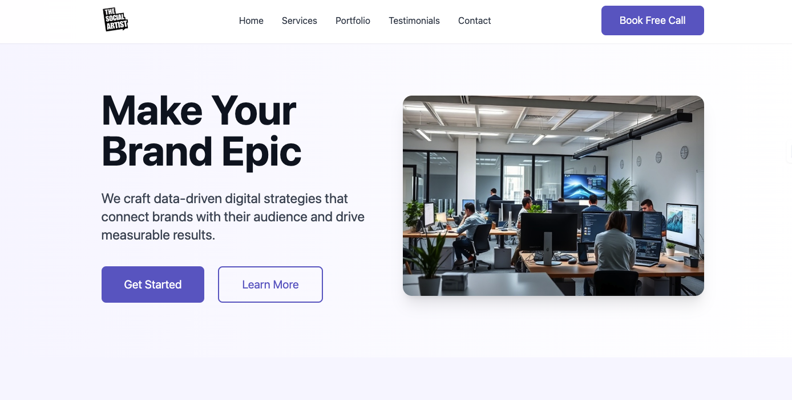

# The Social Artist Landing Page-Freelancing Project

**[Click here to See Live Demo](https://thesocialartist.in/)**

## Overview
This is a freelancing project designed and developed as a landing page for social artists. The page serves as a visually appealing and interactive showcase for artists to 
highlight their work, engage with audiences, and build a strong online presence.

## Tech Stack

  - HTML - Structure and content

  - Tailwind CSS - Styling and responsiveness

  - JavaScript - Interactivity and dynamic elements

## Features Implemented

 1. Responsive Design

    - Used Tailwind CSS for a fully responsive layout across different screen sizes.

    -  Ensured mobile-first design principles for better accessibility.

 2. Hero Section

    - Designed a captivating hero section with an engaging background image and artist introduction.

    - Implemented smooth scroll animations.

3. About Section

   - Created an artist bio section with an image and a short description.

   - Used flexbox and grid in Tailwind for proper alignment.

4. Portfolio Showcase

   - Developed an interactive portfolio/gallery section to showcase artworks.

   - Used hover effects and modal pop-ups to display full-sized images.

5. Contact Form with EmailJS

   - Built a functional contact form that allows users to reach out to the artist.

   - Integrated EmailJS to send messages directly to the artist's email.

   - Added a toast notification for success or failure messages.

6. Smooth Animations & Transitions

   - Used CSS animations and JavaScript event listeners for a seamless user experience.

   - Implemented scroll reveal animations to make elements appear dynamically.

## Future Enhancements

   - Add dark mode toggle

   - Integrate a blog section

   - Improve SEO optimization

## Author

  Designed and developed by Lahori Venkatesh-NIT Jaipur
